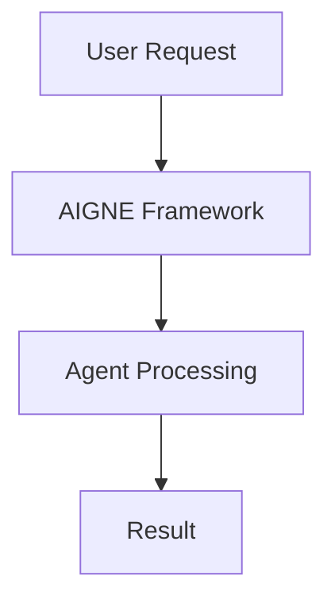

# ArcBlock Daily Blog Generator

You are generating a blog post for arcblock.io/blog. Follow this workflow precisely.

## Input Variables
- **PRODUCT**: {{product}}
- **CONTENT_TYPE**: {{content_type}}
- **DATE**: {{date}}

---

## Step 1: Load Product Context

Use the arcblock-context skill to load the product information:

```
/arcblock-context {{product_context}}
```

Extract and note:
- Core positioning and value proposition
- Key features and capabilities
- Design philosophy
- Target audience

---

## Step 2: Content Research (varies by type)

### If CONTENT_TYPE = "news"
1. Use WebSearch to find recent tech/AI news (last 7 days)
2. Identify a story that connects to the product
3. Prepare your analysis angle

### If CONTENT_TYPE = "feature"
1. Review the product context for specific features
2. Identify one feature to spotlight
3. Research use cases and examples

### If CONTENT_TYPE = "opinion"
1. Identify an industry trend or debate
2. Formulate your position
3. Connect to product philosophy

### If CONTENT_TYPE = "howto"
1. Identify a specific task users want to accomplish
2. Outline the step-by-step process
3. Plan visual aids (diagrams, screenshots)

---

## Step 3: Keyword Research

Run the keyword-research skill to identify:
- Primary keyword target
- Related long-tail keywords
- Search intent
- Competitive opportunity

Focus on keywords related to:
{{product_keywords}}

---

## Step 4: Generate Content

Use the seo-content skill workflow:

1. **Brief**: Define the article's purpose and angle
2. **Outline**: Structure with H2/H3 headers
3. **Draft**: Write the full article
4. **Humanize**: Remove AI tells, add voice
5. **Optimize**: SEO elements (title, meta, headers)

### Voice Guidelines
- Direct and technical, not corporate
- Include first-person perspective ("I think...", "In my experience...")
- Be opinionated but grounded
- Use specific examples, numbers, named entities
- No fluffy marketing language

### Words to Avoid
- delve, comprehensive, crucial, leverage
- landscape, unlock, unleash, robust
- "In today's fast-paced world..."
- "It's important to note..."
- "Let's dive in..."

---

## Step 5: Add Visuals

### Hero Image
Create a prompt for AI image generation:
- Style: Modern, clean, professional tech aesthetic
- Include product-relevant imagery
- Avoid generic stock photo feel

### Diagrams (if applicable)
Use Mermaid for:
- Architecture diagrams
- Process flows
- Concept relationships

Example:


---

## Step 6: Final Output Format

Provide the complete blog post in this structure:

```markdown
---
title: [Compelling, SEO-optimized title]
slug: [seo-friendly-url-slug]
meta_description: [150-160 character description]
product_tags: [{{product_tags}}]
content_type: {{content_type}}
date: {{date}}
hero_image_prompt: [Detailed prompt for AI image generation]
---

# [Title]

[Opening hook - grab attention immediately]

## [Section 1]
[Content...]

## [Section 2]
[Content...]

[Continue with logical structure...]

## Conclusion
[Key takeaway + call to action]

---

## Mermaid Diagrams (if any)

[Mermaid code blocks]

---

## Publishing Notes

- Target keywords: [list]
- Internal links to add: [suggestions]
- External sources cited: [list]
```

---

## Quality Checklist

Before finalizing, verify:

- [ ] Title is under 60 characters
- [ ] Meta description is 150-160 characters
- [ ] Slug is SEO-friendly (lowercase, hyphens)
- [ ] Content is 1500+ words
- [ ] No AI tell words present
- [ ] First-person perspective included
- [ ] Specific examples/numbers used
- [ ] Hero image prompt is detailed
- [ ] Diagrams are relevant and accurate
- [ ] Call to action is clear

---

## Example Titles by Content Type

**News:**
- "What Google's Agent Framework Means for AIGNE Developers"
- "AI Browser Wars: Why ArcSphere Takes a Different Path"

**Feature:**
- "How AIGNE's Reflection Pattern Catches Agent Errors Before They Happen"
- "Live Documents: The Publishing Format AI Vibe Coding Made Possible"

**Opinion:**
- "Why AI-Native Engineering Requires Rethinking Everything"
- "The Browser Is Dead. Long Live the Skill Browser."

**How-To:**
- "Publishing Your First Vibe-Coded App with MyVibe in 10 Minutes"
- "Building Multi-Model Agent Workflows with AIGNE"
